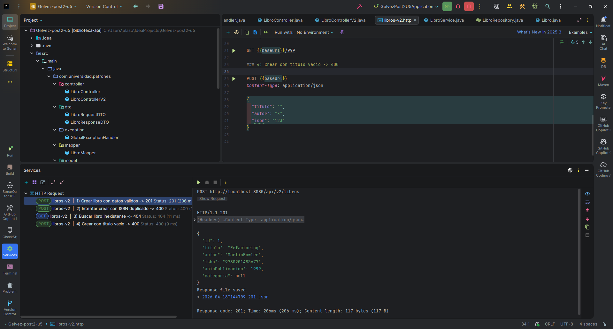
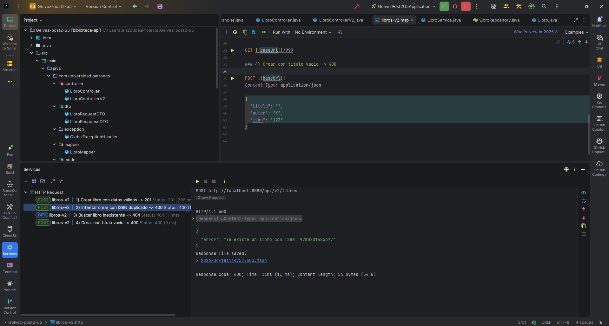
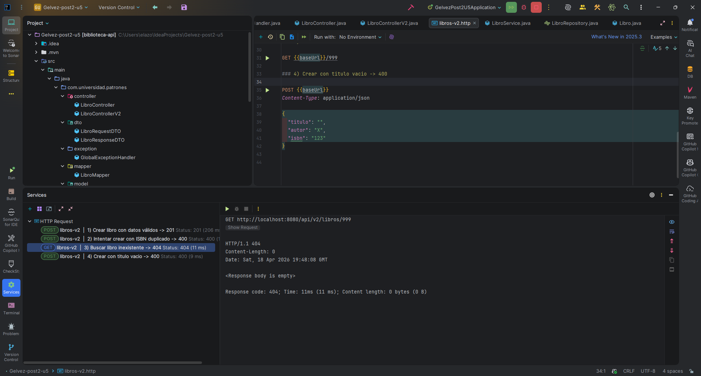
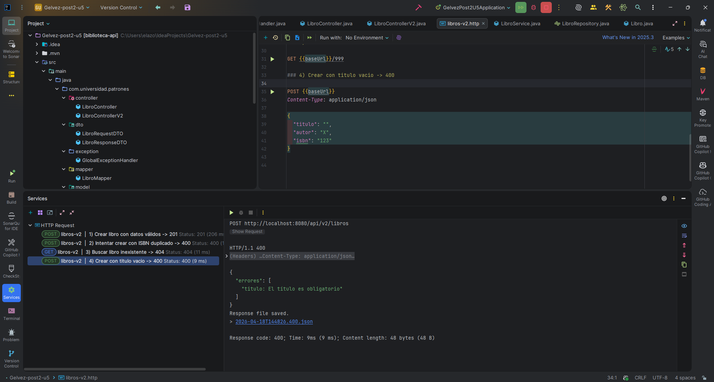

# Biblioteca API - Gelvez-post2-u5

API REST construida con Spring Boot para gestionar un catalogo de libros.

## Descripcion del proyecto

Este proyecto expone endpoints para crear, listar, consultar, actualizar, eliminar y buscar libros.
Actualmente incluye dos versiones de API:

- `v1`: endpoints directos sobre entidad (`/api/libros`)
- `v2`: endpoints con DTOs y documentacion OpenAPI (`/api/v2/libros`)

Reglas de negocio y validaciones principales:

- No se permite registrar ISBN duplicado.
- Se validan campos obligatorios (`titulo`, `autor`, `isbn`).
- Se valida rango del anio de publicacion.
- Se centraliza el manejo de errores HTTP 400 y 404.

## Dependencias principales

Definidas en `pom.xml`:

- `spring-boot-starter-webmvc`: construccion de API REST.
- `spring-boot-starter-data-jpa`: acceso a datos con JPA/Hibernate.
- `spring-boot-starter-validation`: validacion con `@Valid` y Bean Validation.
- `com.h2database:h2`: base de datos embebida en memoria.
- `org.springdoc:springdoc-openapi-starter-webmvc-ui`: Swagger UI / OpenAPI.
- `org.projectlombok:lombok`: reduccion de codigo repetitivo (getters/setters, etc.).

## Requisitos previos

- Java 17
- Maven (o usar Maven Wrapper incluido: `mvnw` / `mvnw.cmd`)

## Instrucciones de ejecucion

### 1) Clonar y entrar al proyecto

```bash
git clone <URL_DEL_REPOSITORIO>
cd Gelvez-post2-u5
```

### 2) Levantar la aplicacion

En Windows (PowerShell):

```powershell
.\mvnw.cmd spring-boot:run
```

En Linux/macOS:

```bash
./mvnw spring-boot:run
```

La aplicacion queda disponible en:

- API base: `http://localhost:8080`
- Swagger UI: `http://localhost:8080/swagger-ui.html`
- OpenAPI JSON: `http://localhost:8080/api-docs`
- Consola H2: `http://localhost:8080/h2-console`

## Endpoints principales

### API v1 (`/api/libros`)

- `GET /api/libros` - Listar libros
- `GET /api/libros/{id}` - Obtener libro por ID
- `POST /api/libros` - Crear libro
- `PUT /api/libros/{id}` - Actualizar libro
- `DELETE /api/libros/{id}` - Eliminar libro
- `GET /api/libros/buscar?q=texto` - Buscar por palabra

### API v2 (`/api/v2/libros`)

- `GET /api/v2/libros` - Listar libros (DTO)
- `GET /api/v2/libros/{id}` - Obtener por ID (DTO)
- `POST /api/v2/libros` - Crear libro (DTO)
- `DELETE /api/v2/libros/{id}` - Eliminar por ID

## Pruebas de la API

Se incluye el archivo `libros-v2.http` con escenarios de validacion:

1. Crear libro valido -> `201`
2. Crear con ISBN duplicado -> `400`
3. Consultar libro inexistente -> `404`
4. Crear con titulo vacio -> `400`

Puedes ejecutarlo directamente desde IntelliJ/JetBrains usando el cliente HTTP integrado.

## Capturas de pantalla (resultados)

### 1) Crear libro con datos validos (`201`)



### 2) Intento de ISBN duplicado (`400`)



### 3) Consulta de libro inexistente (`404`)



### 4) Creacion con titulo vacio (`400`)



## Notas

- La base de datos H2 es en memoria (`jdbc:h2:mem:biblioteca_db`), por lo que los datos se reinician al detener la aplicacion.
- La configuracion principal se encuentra en `src/main/resources/application.properties`.

